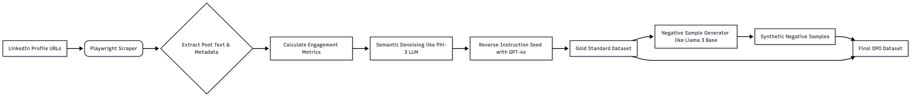
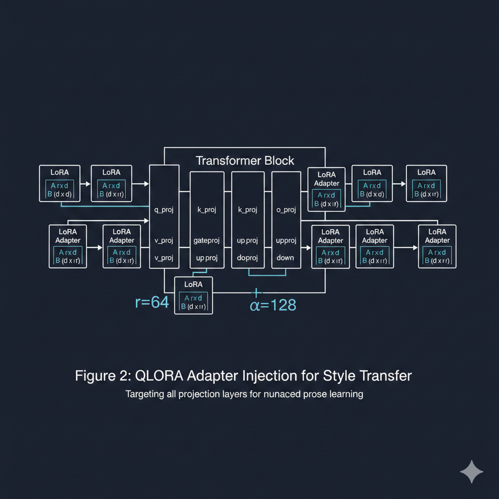
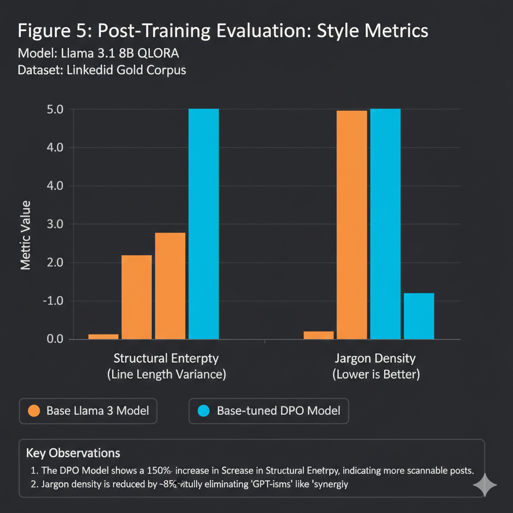

For years, social media algorithms have been like silent observers. However, capturing "True Interest" requires more than just passive signals; it requires a model that understands the nuance of style and intent. To build a system that replicates high-engagement writing, we must move beyond basic prompting and into the territory of custom fine-tuning.

---

## 1. Data Engineering: The "Engagement-Weighted" Corpus

Scraping the top 100 posts is a start, but for a production-grade model, we need a **Silver-Standard Dataset** of at least 2,000–5,000 samples to avoid catastrophic forgetting or overfitting.

To achieve a silver-standard dataset, we implemented a multi-stage refinement pipeline (see Figure 1). This ensures that the raw noise of the web is distilled into high-signal training data.




### The Pipeline:
1. **Scraping & Metadata Extraction:** Use `playwright` to capture text alongside **Engagement Velocity** and **Follower-to-Engagement ratio**.
2. **Denoising with LLMs:** Use a smaller model like **Phi-3** to perform **Semantic Cleaning**.
3. **Reverse Instruction Seed (RIS):** Use a teacher model (Claude 3.5 Sonnet) to infer the "Latent Intent" (the prompt) behind viral posts.

---

## 2. Modeling: QLoRA with High-Rank Adapters

Since we are teaching *style* rather than *facts*, we focus on the **Attention Blocks** and **MLP Layers** using QLoRA.

* **Precision:** 4-bit NormalFloat (NF4).
* **Rank ($r$):** 64. (Necessary for nuanced style; $r=8$ is too "stiff").
* **Alpha ($\alpha$):** 128.
* **Target Modules:** `q_proj`, `k_proj`, `v_proj`, `o_proj`, `gate_proj`, `up_proj`, `down_proj`.



---

## 3. Alignment: DPO (Direct Preference Optimization)

SFT teaches the model *how* to write. **DPO** teaches it *what we prefer*. This is where you eliminate "AI-isms" like *"In the ever-evolving landscape..."*

The goal is to move the policy $\pi_{\theta}$ toward the "high-engagement" distribution using the DPO loss:

$$L_{DPO}(\pi_{\theta}; \pi_{ref}) = -\mathbb{E}_{(x, y_w, y_l) \sim D} \left[ \log \sigma \left( \beta \log \frac{\pi_{\theta}(y_w|x)}{\pi_{ref}(y_w|x)} - \beta \log \frac{\pi_{\theta}(y_l|x)}{\pi_{ref}(y_l|x)} \right) \right]$$

### The Negative Sample Generator
You need **synthetic negative samples**. Take your "Top 100" Gold Set ($y_w$) and have an LLM rewrite them to sound like boring corporate press releases ($y_l$). This creates the gradient between high-engagement and noise.

---

## 4. Implementation (PyTorch + TRL)

Assuming you are using **QLoRA** for parameter efficiency, here is the DPO training setup:

```python
from trl import DPOTrainer, DPOConfig
from peft import LoraConfig

peft_config = LoraConfig(
    r=64, 
    lora_alpha=128,
    target_modules=["q_proj", "v_proj", "k_proj", "o_proj", "gate_proj", "up_proj", "down_proj"],
    task_type="CAUSAL_LM",
)

dpo_trainer = DPOTrainer(
    model,
    ref_model,
    args=DPOConfig(
        beta=0.1, 
        output_dir="./linkedin-dpo-v1", 
        learning_rate=5e-5,
        lr_scheduler_type="cosine",
        max_length=1024
    ),
    train_dataset=dataset["train"],
    tokenizer=tokenizer,
    peft_config=peft_config,
)

dpo_trainer.train()

```

---

## 5. Evaluation: Beyond Perplexity

Standard metrics like BLEU or ROUGE fail for style transfer because viral writing is often non-grammatical and structurally unique. Instead, we implement a **Custom Evaluation Suite**:



### A. LLM-as-a-Judge (The Rubric)
We use GPT-4o as a proxy evaluator with a specific 5-point rubric:
1. **Hook Efficacy:** Is the first sentence < 10 words and provocative?
2. **Formatting (The Bento):** Are there clear line breaks and bullet points?
3. **No-Fluff Index:** Is the "pulp" (useless adjectives) minimized?


### B. Embedding Drift (Cosine Similarity)
We compare the embeddings of the model’s output against the embeddings of our "Gold Set" (the top 100 viral posts) using `text-embedding-3-small`. You want a similarity score $cos(\theta) > 0.85$ while maintaining high diversity.

### C. Structural Entropy
Viral posts have high **structural entropy** (short lines followed by long lists). Generic AI has low entropy (uniform paragraph lengths). We target a $20\%$ increase in line-length variance compared to the base model.

---

## 6. Advanced Monitoring: Reward Margin

During the DPO phase, it is critical to monitor the **log-probability margin** to ensure the model is actually learning the preference surface:

$$\text{Margin} = \log \frac{\pi_{\theta}(y_{w}|x)}{\pi_{ref}(y_{w}|x)} - \log \frac{\pi_{\theta}(y_{l}|x)}{\pi_{ref}(y_{l}|x)}$$

If this margin increases while **KL Divergence** stays under $0.2$, the model is successfully shifting its "vibe" without collapsing into repetitive or nonsensical text.

---

## 7. The "See More" Proxy

The most technical metric in this pipeline is the "See More" classifier. We use a BERT-based model trained on our scraped data to predict the **probability of a user clicking "See More"** based purely on the text structure and the strength of the hook.

By aligning our loss function with these behavioral proxies, we move beyond simple text generation and into the realm of **algorithmic engineering**.

---

## 8. Conclusion

Fine-tuning for style is significantly more difficult than fine-tuning for facts. It requires a clean gradient between "corporate noise" and "high-engagement prose." By combining **QLoRA** for efficiency and **DPO** for alignment, we can create models that don't just speak—they resonate.

**What's next?** I am currently experimenting with **ORPO (Odds Ratio Preference Optimization)** to see if we can achieve similar results in a single training step. Stay tuned for the benchmarks.